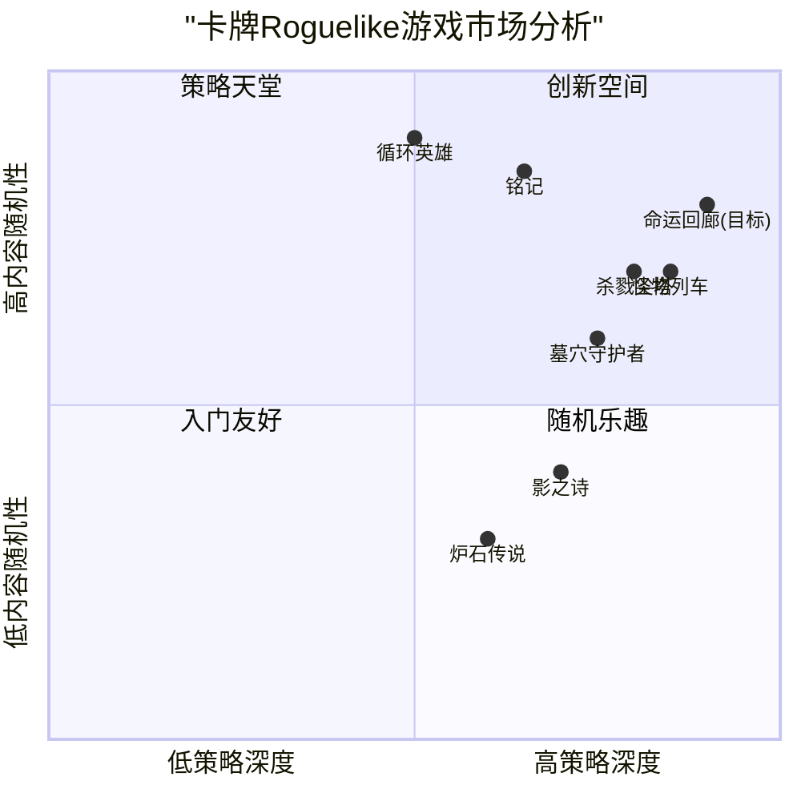

# 《命运回廊》(Destiny Corridor) - 卡牌Roguelike产品需求文档(PRD)

## 1. 项目概述

### 1.1 项目信息
- **项目名称**：命运回廊 (Destiny Corridor)
- **开发语言**：React, JavaScript 和 Tailwind CSS
- **游戏类型**：2D卡牌Roguelike游戏
- **平台**：PC优先，后续可扩展至移动端和主机平台

### 1.2 原始需求
设计一款创新的2D卡牌Roguelike游戏，融合动态牌面系统、命运轮盘机制、空间战棋策略、记忆回廊系统、动态叙事引擎和协同作战模组等创新玩法，并通过模组工坊和赛季轮回机制增强游戏的商业化潜力。

## 2. 产品定义

### 2.1 产品目标
1. **创造创新的卡牌体验**：通过正/逆位双形态卡牌和动态属性系统，提供前所未有的策略深度
2. **融合多元游戏机制**：将卡牌、战棋和Roguelike元素无缝结合，形成独特的游戏循环
3. **建立可持续发展平台**：通过模组工坊和赛季系统，打造长生命周期的游戏生态系统

### 2.2 用户故事
1. **作为一名策略游戏爱好者**，我希望卡牌具有多种形态和用途，以便我可以根据战场情况制定复杂的策略
2. **作为一名Roguelike游戏玩家**，我希望每次游戏体验都与众不同，让我在每次冒险中都能发现新的内容和挑战
3. **作为一名收集类游戏爱好者**，我希望能够收集和优化我的卡牌，让我感受到长期进步和成就
4. **作为一名创意玩家**，我希望能够创建和分享自己的游戏内容，与社区互动并获得认可
5. **作为一名竞技玩家**，我希望有一个公平且不断变化的竞技环境，让我可以展示自己的技巧和策略

### 2.3 竞品分析

| 竞品名称 | 优势 | 劣势 |
|---------|------|------|
| 杀戮尖塔(Slay the Spire) | 清晰的游戏机制、卡牌平衡性好、高度可重玩性 | 缺乏多样化的战场互动、战斗策略相对固定 |
| 魔兽炉石传说 | 精美的美术风格、庞大玩家基础、强大品牌效应 | 付费模式争议较大、单局游戏缺乏变化 |
| 影之诗(Shadowverse) | 深度策略性、丰富的游戏模式、慷慨的奖励系统 | 学习曲线陡峭、后期平衡问题 |
| 铭记(Inscryption) | 创新性叙事、独特的艺术风格、多层次游戏设计 | 内容有限、缺乏长期游戏支持 |
| 怪物列车(Monster Train) | 多层战场、丰富的种族协同、深度策略 | 视觉辨识度不高、复杂度可能过高 |
| 循环英雄(Loop Hero) | 创新的自动战斗和地图放置机制、独特美学 | 玩家介入度有限、战略性不如纯卡牌游戏 |
| 墓穴守护者(Griftlands) | 结合对话和战斗的双卡组系统、丰富叙事 | 游戏节奏较慢、内容量相对有限 |

#### 2.3.1 竞争象限图

### 2.4 目标用户群体

1. **核心卡牌游戏爱好者** (25-40岁)
   - 喜欢构建卡组和发现卡牌组合的策略玩家
   - 寻求深度战术体验的玩家
   - 偏好有挑战性的游戏内容

2. **Roguelike游戏粉丝** (20-35岁)
   - 享受随机生成内容和高重玩性的玩家
   - 能够接受"死亡重开"机制的玩家
   - 喜欢通过多次尝试掌握游戏机制的玩家

3. **策略游戏爱好者** (30-45岁)
   - 享受战棋类游戏的玩家
   - 偏好思考而非快节奏动作的玩家
   - 喜欢深度规划和长期策略的玩家

4. **休闲创意玩家** (18-30岁)
   - 喜欢创建自定义内容的玩家
   - 活跃在游戏社区中的内容创作者
   - 享受分享和尝试用户创建内容的玩家

## 3. 技术规格

### 3.1 需求分析

#### 核心游戏系统
1. **动态卡牌系统** - 必须支持卡牌的双形态转换和基于移动的数值变化
2. **六边形战棋地图** - 需要高效渲染和处理复杂的战场环境与交互
3. **程序化生成内容** - 地牢、事件、敌人和奖励的随机生成
4. **存档系统** - 记录玩家进度、解锁内容和成就
5. **用户创建内容平台** - 允许玩家创建、分享和使用自定义卡牌规则

#### 技术需求
1. **跨平台兼容性** - 初期支持PC平台，架构设计需考虑未来扩展到移动平台
2. **网络功能** - 支持在线排行榜、卡牌共享和多人模式
3. **服务器架构** - 管理用户账户、创意工坊内容和赛季数据
4. **数据分析系统** - 收集游戏平衡数据，用于赛季更新和卡牌平衡调整

### 3.2 需求池

#### P0 (必须实现的核心功能)
1. 动态牌面系统（正/逆位转换机制）
2. 六边形战棋战场系统
3. 命运轮盘与神谕事件系统
4. 基础卡牌收集与进化系统
5. 核心Roguelike地牢探索流程
6. 角色进度和解锁系统
7. 基础游戏教程

#### P1 (应该实现的重要功能)
1. 记忆回廊系统（跨局游戏进度保存）
2. 动态叙事事件系统
3. 环境拟态效果系统
4. 基础创意工坊功能
5. 成就系统
6. 单人挑战模式
7. 卡牌收集图鉴

#### P2 (可以实现的附加功能)
1. 协同作战双角色模式
2. 高级叙事分支与隐藏剧情
3. 赛季排行与动态禁用机制
4. 扩展创意工坊（含高级编辑器）
5. 社区卡牌评分与分享系统
6. 全球挑战与活动系统
7. 深度统计与分析工具

### 3.3 UI设计草图

#### 3.3.1 主界面布局
- 中央为游戏标志"命运回廊"
- 左侧为主要导航菜单：冒险模式、卡牌收集、命运轮盘、创意工坊、设置
- 右侧显示当前角色、解锁进度和最近成就
- 底部显示当前赛季信息和活动通知

#### 3.3.2 战斗界面
- 上方为当前回合信息、能量值和手牌区
- 中央为六边形战场网格，显示角色、敌人和环境效果
- 左侧为角色状态、卡组和弃牌堆
- 右侧为敌人信息和意图显示
- 底部为特殊能力和道具快捷栏

#### 3.3.3 卡牌设计
- 正位/逆位状态清晰可辨
- 显示基础属性和当前增益/减益效果
- 包含简洁的效果描述和触发条件
- 特殊卡牌具有独特视觉效果

#### 3.3.4 命运轮盘界面
- 中央为可旋转的轮盘，分为不同神明区域
- 显示当前可获得的祝福和代价
- 神明形象与祝福效果直观连接
- 轮盘底部显示命运硬币余额和重置选项

### 3.4 开放问题

1. **游戏难度平衡**
   - 如何平衡卡牌的正/逆位强度差异？
   - 命运硬币的获取速率如何设计才能避免滥用？

2. **创意工坊限制**
   - 用户创建卡牌需要哪些限制来避免游戏平衡问题？
   - 如何建立有效的审核机制以保证用户内容质量？

3. **商业化策略**
   - 游戏采用一次性付费还是免费加内购模式更合适？
   - 赛季内容采用免费更新还是付费DLC形式？

4. **技术实现挑战**
   - 如何优化复杂的卡牌效果计算以确保游戏流畅性？
   - 如何设计架构支持未来的跨平台扩展？

## 4. 游戏系统详细设计

### 4.1 核心机制创新

#### 4.1.1 动态牌面系统

**正/逆位卡牌系统**
- 每张卡牌具有正位和逆位两种形态，拥有不同但相关的效果
- 转换触发条件包括：
  - 环境交互（如冰系卡牌进入火焰地形转为蒸汽效果）
  - 特定角色能力（主动转换特定类型卡牌）
  - 敌人特殊能力（强制转换玩家卡牌）
  - 事件触发（特定事件可能改变整个卡组的位置）

**示例卡牌转换：**
- 「冰锥术」(正位)：对目标造成8点伤害并施加1回合冰冻效果
  - 逆位转换为「蒸汽爆发」：对范围内所有目标造成5点伤害并施加1回合失明效果

**移动轨迹加成系统**
- 卡牌基础数值受角色移动影响，鼓励策略性移动
- 加成类型根据卡牌种类不同：
  - 攻击卡：移动后伤害提升
  - 防御卡：静止时效果提升
  - 治疗卡：特定移动模式（如圆形路径）触发额外效果

**示例移动效果：**
- 「疾风打击」：基础伤害10点，每移动2格伤害+15%，最多+45%
- 「坚定壁垒」：基础护盾12点，连续2回合不移动护盾值+50%

#### 4.1.2 命运轮盘机制

**神谕事件系统**
- 每层地牢随机生成3个神谕事件，玩家可选择一个激活
- 每个神明提供独特的祝福和改变游戏规则的效果
- 神明选择会影响卡池分布，使特定类型卡牌更容易或更难获得

**主要神明及其效果：**
- 战神：攻击卡牌概率+30%，治疗卡牌概率-30%，所有攻击伤害+20%
- 智慧女神：技能冷却时间-25%，卡牌抽取次数+1，遇到精英敌人概率+15%
- 幸运之神：稀有卡牌出现率+20%，随机效果结果偏向有利方，宝箱出现率+25%
- 死亡神明：最大生命值-20%，敌人生命值-30%，击败敌人获得的经验值+50%

**命运硬币系统**
- 命运硬币作为稀有资源，通过以下方式获得：
  - 击败精英敌人
  - 完成特殊挑战
  - 放弃稀有奖励
  - 触发特定事件
- 命运硬币用途：
  - 重置当前楼层：改变敌人等级或分布
  - 刷新商店物品
  - 修改卡牌属性
  - 逃离致命战斗

### 4.2 策略维度拓展

#### 4.2.1 空间战棋融合

**六边形战场系统**
- 战斗在六边形网格上进行，每个单位占据一个六边形格子
- 格子类型多样：普通地面、火焰地形、冰冻地形、毒雾地形、能量地形等
- 地形效果与卡牌互动，创造复杂策略可能性

**卡牌站位联动**
- 相邻单位可以共享特定效果，如护盾、增益效果等
- 特殊阵型可触发组合效果（如三角形站位触发"三位一体"增益）
- 敌人也会利用站位策略，需要玩家通过定位破坏其阵型

**空间操控卡牌**
- 特殊卡牌可以改变战场布局或单位位置
- 「空间折叠」：交换两个区域的位置，包括其中的单位和地形效果
- 「引力波动」：将敌人拉向特定地形或推离有利位置
- 「区域封锁」：临时使特定区域无法通行或使用特定类型卡牌

#### 4.2.2 记忆回廊系统

**遗物记忆机制**
- 玩家死亡时，游戏分析其本局表现最好的3张卡牌
- 这些卡牌转化为初始卡牌，但效果降低到50%
- 玩家可以在新的冒险中逐渐恢复这些卡牌的完整效果

**进阶解锁条件**
- 完成特定连续条件可解锁特殊卡组和能力：
  - 连续3局不使用治疗卡：解锁"苦修者"卡组
  - 连续击败5个同属性Boss：解锁该属性"元素亲和"能力
  - 在单局中使用10次逆位卡牌：解锁"混沌法师"称号和特殊能力

**时空悖论卡组**
- 通过特殊挑战解锁的独特卡牌系列
- 每张卡牌同时具备多种互补属性（如攻击同时治疗、防御同时反击）
- 使用条件苛刻或代价较高，但效果强大

### 4.3 差异化体验设计

#### 4.3.1 动态叙事引擎

**NPC交互系统**
- 对话选择会影响卡牌词缀和游戏事件
- 角色声望系统记录与不同派系NPC的关系
- 选择可以解锁隐藏支线任务和独特奖励

**示例NPC互动：**
- 商人互动：
  - 诚实交易：普通价格购买物品
  - 砍价：有机会降低价格或惹恼商人
  - 欺骗：获得折扣但降低声望，可能触发偷窃卡牌特殊效果

**动态事件链**
- 游戏追踪玩家行为和决策，生成相应的事件链
- 特定条件触发独特挑战或隐藏关卡
- 事件结果影响后续游戏内容和难度

**示例事件链：**
- 「元素之路」：连续击败3个火焰系敌人 → 触发火山喷发事件 → 获得挑战火焰领主机会 → 成功后获得「凤凰涅槃」特殊能力

#### 4.3.2 协同作战模组

**双角色系统**
- 玩家可以选择两个角色组成团队，每个角色拥有独立卡组
- 当主控角色濒死时自动切换到备用角色
- 角色之间共享冷却回合和特定资源

**角色协同效果**
- 不同角色组合提供独特的协同加成
- 特殊"双人卡牌"需要两位角色特定条件才能使用

**环境拟态系统**
- 战场环境动态变化，影响卡牌效果
- 环境条件示例：
  - 潮湿：雷系卡牌范围扩大50%，火系卡牌伤害-20%
  - 沙尘：风系卡牌伤害+30%，命中率所有卡牌-10%
  - 月光：暗系卡牌冷却时间-1，光系卡牌花费+1

### 4.4 商业化亮点

#### 4.4.1 模组工坊体系

**卡牌规则编辑器**
- 允许玩家创建自定义卡牌和效果
- 编辑器功能：
  - 视觉设计（使用预设素材）
  - 效果设置（从预定义效果库中组合）
  - 触发条件配置
  - 数值平衡调整

**创意内容分享**
- 玩家可以上传自创卡牌到创意工坊
- 评分和推荐系统展示高质量社区内容
- 开发团队定期精选优质内容纳入官方DLC

**收益分成模式**
- 被选入官方DLC的创作者获得销售分成
- 创意内容等级系统，鼓励高质量创作
- 社区投票影响选择过程和分成比例

#### 4.4.2 赛季轮回机制

**赛季内容更新**
- 每个赛季（约3个月）推出新内容和平衡调整
- 赛季主题影响新卡牌设计和游戏机制
- 赛季结束时进行数据分析，为下个赛季做准备

**平衡调整系统**
- 使用率数据分析指导卡牌平衡
- 「禁忌牌组」系统：上赛季使用率最低的卡牌获得大幅强化
- 特定卡牌组合过强时可能被标记为"传说"，增加获取难度

**动态天梯系统**
- 竞技模式采用周更新的动态禁用机制
- 每周分析数据，自动禁用胜率前10%的卡牌组合
- 鼓励玩家不断探索新策略和适应变化

## 5. 实施计划

### 5.1 开发阶段

1. **原型阶段** (2-3个月)
   - 核心游戏循环实现
   - 基本卡牌系统
   - 简易六边形战斗系统

2. **Alpha阶段** (3-4个月)
   - 完整核心系统（P0功能）
   - 基础内容（50-80张卡牌）
   - 内部平衡测试

3. **Beta阶段** (4-5个月)
   - 实现P1优先级功能
   - 扩展游戏内容
   - 封闭测试并收集反馈

4. **发布准备阶段** (2-3个月)
   - 游戏优化和打磨
   - 实现部分P2功能
   - 准备发布材料和营销内容

### 5.2 里程碑

1. **技术验证** - 完成核心卡牌系统和六边形战斗原型
2. **内部测试版** - 实现完整游戏循环和基础内容
3. **封闭Beta测试** - 邀请特定玩家测试并收集反馈
4. **Early Access发布** - 在主要平台发布早期访问版本
5. **正式发布** - 完整版本发布，包括所有计划功能

### 5.3 关键性能指标(KPI)

- **玩家留存率**：7天留存目标40%，30天留存目标25%
- **游戏时长**：单次会话平均45分钟，每周平均5小时
- **内容参与度**：70%的玩家至少完成一次完整地牢探索
- **社区参与**：20%的活跃玩家参与创意工坊内容创建或使用
- **商业目标**：首月销售50,000份，首年销售200,000份

## 6. 总结

《命运回廊》通过创新的卡牌机制、战棋策略元素和Roguelike随机性，将为玩家提供一种独特且高度可重玩的游戏体验。其核心创新在于动态牌面系统和命运轮盘机制，而长期发展潜力则由模组工坊和赛季更新提供支持。

通过精心设计的游戏系统，《命运回廊》有潜力吸引广泛的目标受众，从卡牌游戏爱好者到策略游戏玩家，以及寻求创新游戏体验的玩家。随着游戏的发展和内容更新，《命运回廊》有望成为卡牌Roguelike类型的代表作品之一。